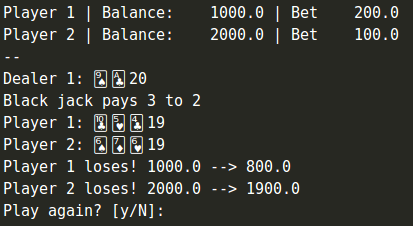
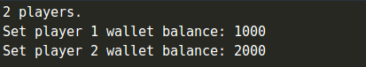
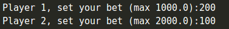
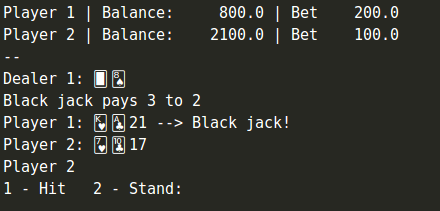
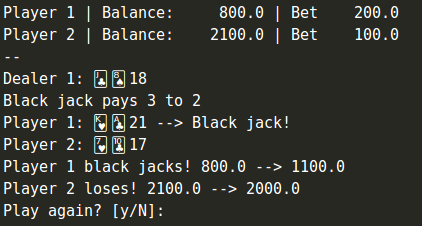

# Simple one-python-file Black Jack!
A command line black jack for n-RAM-limited human-being players and an "intelligent" computer dealer.



## Who was the game made for?
* For you, tired of playing Tic Tac Toe \m/
* Beginner python learners
* Who wants to start collaborating with free software projects

or for myself, who wanted to remember my pythonic skills.

## Requirements
* (Optional) Docker
* Python 3

## How do run it

    $ git clone https://github.com/colares/py-black-jack.git
    $ cd py-black-jack

### From your local Python env
    $ python main.py

### If you're a docker person

    $ docker run -it --rm --name black-jack \
        -v "$PWD":/usr/src/myapp \
        -w /usr/src/myapp python:3 \
        python main.py


## Gameplay

### 1 Setup your players

Define how many player are going to play and hit ```Enter```:


Define the initial balance for each player:



### 2 Let's start a new hand

Each player place a bet:



Hand overview:





### 3 Are you done?


## Learn how to play Black Jack, the simple way
https://www.youtube.com/watch?v=idB-7FUaC-g


> **Buckle up and enjoy a marvel experience! :)** -- Thiago Colares

## License
This project is licensed under the terms of the [GNU General Public License v3.0](https://github.com/colares/py-tic-tac-toe/blob/master/LICENSE "GNU General Public License v3.0")
